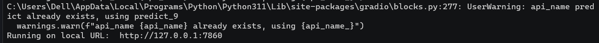
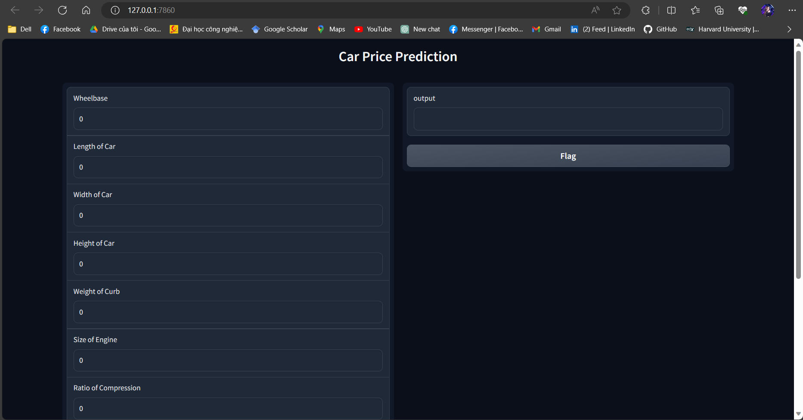

# Used Car Price Prediction Using Random Forest, RFE and Gradio
This repository contains the machine learning model using Random Forest Regressor in Scikit-learn to predict the price of used car.

---
## What was used ?
- Random Forest Algorithm (Note)
- RFE (Note)
- Bootstrapping (Note)
- Gradio (Note)

---
## Dataset
I used a dataset on [Kaggle](https://www.kaggle.com/datasets/aminesnoussi/carprice-assignmentcsv) with 25 features of an used car contains 10 categorical features and 15 numerical features

---
## How to use this repo ?

- Install important libraries : 
```
pip install -r requirments.txt
```

Note : After running all the carPrediction notebook, the random_forest_model.pkl and important_features.pkl will be produced

- Run the demo.py to deploy the model with Gradio :

```
python demo.py
```
- Get the link to go on the web : 


- Result :


---
## Reference
1. [Deep AI Khanh Blog | Random Forest](https://phamdinhkhanh.github.io/deepai-book/ch_ml/index_RandomForest.html)
2. [Machine Learning Mastery | RFE](https://machinelearningmastery.com/rfe-feature-selection-in-python/)
3. [FreeCodeCamp | Gradio for Deployment](https://www.freecodecamp.org/news/how-to-deploy-your-machine-learning-model-as-a-web-app-using-gradio/) 